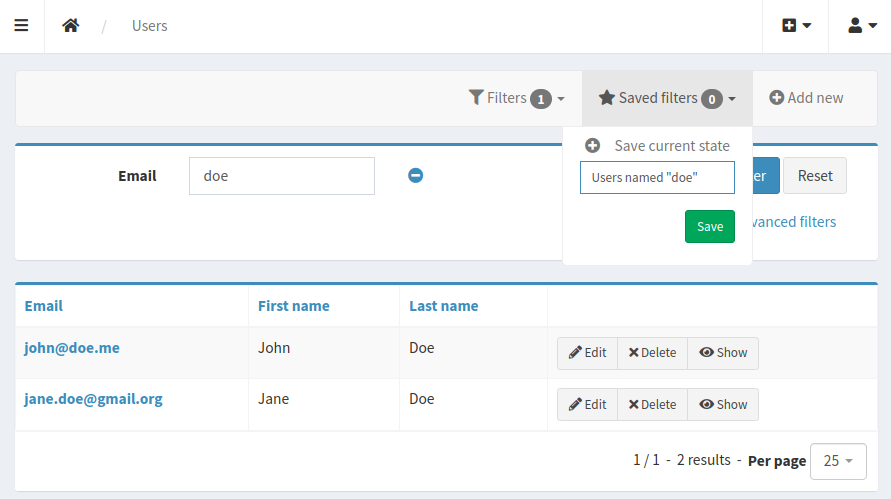
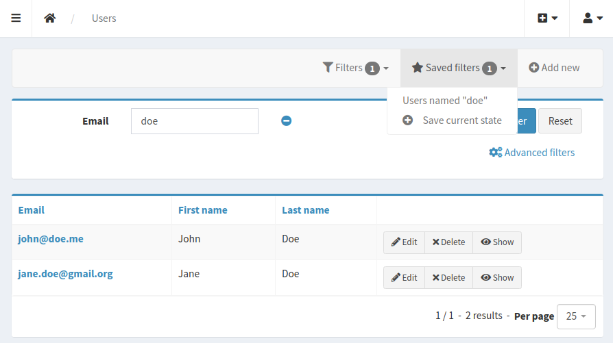
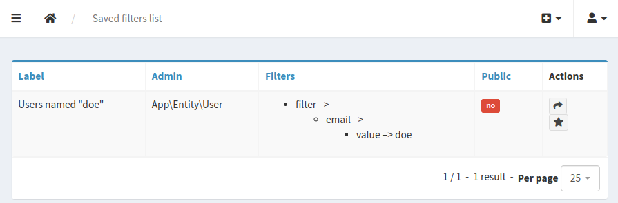

# PrestaSonataSavedFiltersBundle

PrestaSonataSavedFiltersBundle will allow your Sonata users to save and share list filters.

  
  


## Installation

Install the bundle with the command: 
```console
$ composer require presta/sonata-saved-filters-bundle
```

Enable the bundle:
```diff
# config/bundles.php
return [
+    Presta\SonataSavedFiltersBundle\PrestaSonataSavedFiltersBundle::class => ['all' => true],
];
```

## Configuration

Import our Javascripts in your project:
```javascript
import '../../public/bundles/prestasonatasavedfilters/scripts/app';
```

> This step is highly dependent on how your public assets are built, imported.
> It's up to you knowing the best way to include it in your project.

Include our action template into the Twig template you configured to be your admin layout:
```twig



    {{ parent() }}
    {{ include('@PrestaSonataSavedFilters/saved_filters_action.html.twig') }}

```

> See related SonataAdmin [documentation](https://docs.sonata-project.org/projects/SonataAdminBundle/en/4.x/reference/templates/#global-templates)

Configure to doctrine that what entity will be attached to saved filters `config/packages/doctrine.yaml`:

```php
<?php

use Doctrine\ORM\Mapping as ORM;
use Presta\SonataSavedFiltersBundle\Entity\SavedFiltersOwnerInterface;
use Symfony\Component\Security\Core\User\UserInterface;

#[ORM\Entity]
class User implements UserInterface, SavedFiltersOwnerInterface
{
}
```

```yaml
# config/packages/doctrine.yaml
doctrine:
  orm:
    resolve_target_entities:
      Presta\SonataSavedFiltersBundle\Entity\SavedFiltersOwnerInterface: 'App\Entity\User'
```

> See related DoctrineBundle [documentation](https://symfony.com/doc/current/doctrine/resolve_target_entity.html)

Finally, update your schema to create the tables required for our entities:
```console
$ bin/console doctrine:schema:update 
```

> Or create a migration if you have `DoctrineMigrationsBundle` installed:
> ```console
> $ bin/console doctrine:migrations:diff
> $ bin/console doctrine:migrations:migrate
> ```
